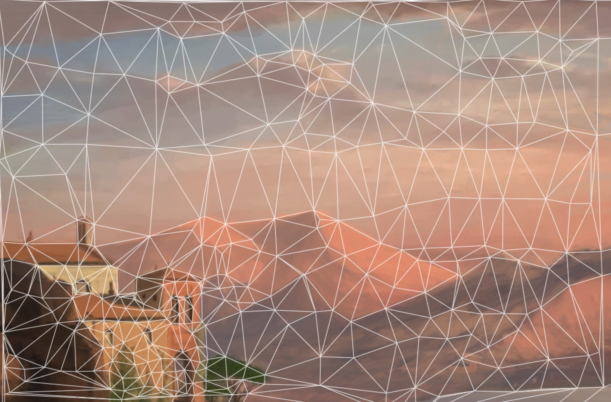

# Dots 2 Pixels

Light-weight browser interface for creating triangulation art.

* * *
[Check it out!](https://andrewtorgesen.com/res/dots2pixels.html)
* * *

I'm a big fan of low-poly art for desktop backgrounds and whatnot. There are [tools out there](https://blogging.com/low-poly-generators/) that let you easily generate low-poly art from photographs, though a problem I have with them is that, in general, you don't get complete control over the vertex locations of the generated polygons (at least, not without paying). As of this writing, there also don't seem to be many tools that are accessible through a browser that are up-to-par, either. While complete control can be afforded by using a free program like Inkscape to overlay and colorize polygons on top of an image yourself, that prospect seemed a little too labor-intensive for me; I wanted a tool that gave me complete control over the finished product while also not involving any more work than simply clicking points on an image and having the rest auto-generated for me. 

In theory, you should be able to pick a bunch of points in a 2D plane and auto-generate triangles out of those points. Luckily, before working too long at trying to make an algorithm for this, I discovered  that there's already an algorithm that does the trick: Delaunay triangulation. Moreover, there's a [very fast Javascript implementation](https://github.com/mapbox/delaunator) that made a browser-based solution a no-brainer. With the help of this library, which converts a list of 2D points into a set of triangle points within milliseconds, it took a couple of hours to write a browser-based tool that lets you drag-and-drop an image, create/destroy arbitrarily-placed points at your leisure (visualizing the created triangles in real-time), and generate the triangulated image with one keystroke. And it works on any device with an internet browser. Features such as these are very simple, and it annoyed me that they didn't appear to all be available for free in a single package. Now, I can take a picture with my phone, open it on my iPad, strategically place some triangulation points with a stylus, and save the low-poly image in a matter of minutes wherever I am:

 

Gotta love convenient art.
